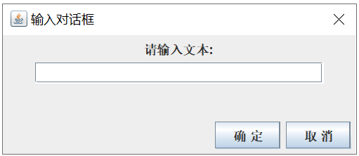

## 								<center>miniCAD</center>


<h5>
    <center>2021-10-30 </center>  
</h5>             


##### <center>混合1902</center>


##### <center>余丛杉</center>


##### <center>3190103165</center>


<div STYLE="page-break-after: always;"></div>

### 01. 题目要求

做一个简单的绘图工具，以CAD的方式操作，能放置直线、矩形、圆和文字，能选中图形，修改参数，如颜色等，能拖动图形和调整大小，可以保存和恢复。功能请参考视频演示。
要求上传：

1. 源码；
2. 实验报告；
3. 可执行的jar文件。

演示视频下载链接: https://pan.baidu.com/s/1dFaZ2Ml 密码: d3xg

### 02. 操作手册

做一个简单的绘图工具，以CAD的方式操作。

+ **界面**

   

+ **铅笔** **&** **刷子**
  + 支持`回退`
  + 支持`撤销回退`
  + 支持`橡皮`

+ **喷枪**
  
  + 支持`橡皮`
  
+ **直线** **& 圆 & 矩形** 

  + 支持在拖动时调整大小
  + 支持`选择`后拖动
  + 支持`加粗` `变细`
  + 支持`放大` `缩小`
  + 支持`回退` `撤销回退`
  + 支持`删除`

+ **文字**

  + 输入文字后需拖动产生对象
  + 支持`放大` `缩小`

+ **橡皮**

  + 此功能不支持拖动

+ **选择**

  + 按下后，可以在画布中选中图形，也可以拖动图形
  + 鼠标单击时，在矩形的内部和边界，矩形被选中
  + 鼠标单击时，在文字的内部和边界，椭圆被选中
  + 鼠标单击时，在椭圆的内部和边界，椭圆被选中
  + 鼠标单击时，在直线的内部和边界，椭圆被选中
  + 如果同时有多个图形能被选中，取最上面那个

+ **删除**

  + 需先选中对象
  + 按下删除键后可以从画图板中删除

+ **回退**

  + 回退最近的一次画图操作
  + 回退的只是目前画板最上层的对象
  + 删除一个对象后是无法回退的
  + 如果通过鼠标单击拖动某图形，它会位于最高层，回退时会先回退

+ **撤销回退**

  + 重做最近的一次画图操作

+ **保存**

  + 按下后会弹出一个对话框，输入需保存的文件名
  + 可将当前画板的所有对象序列化输出
  + 文件保存在项目文件下

+ **打开**

  + 按下后会弹出一个对话框，输入将打开的文件名
  + 可将当前画板的所有对象序列化输出
  + 打开项目文件路径下的文件

+ **颜色面板**

  + 可以切换所有图形的颜色

+ **案例**

  

### 03.代码细节

####  3.1 框架


+ 抽象类`Shape`类，用来描述一个图形
  + `Circle` `Eraser` `Rect` `String` `GUm` `Line` `MyString` 继承`Shape`抽象类
    + 实现抽象函数 `public abstract void draw(Graphics2D g)`画图形
    + 实现抽象函数 `public abstract boolean click( double curX, double curY )` 判断是否被选中
+ 所有任务都由`Draw`类分配
  + 实现 `ActionListener`, `MouseListener`, `MouseMotionListener`接口监听鼠标操作
    + 重载`public void actionPerformed(ActionEvent e)`
    + 重载`public void mousePressed(MouseEvent e)`
    + 重载`public void mouseReleased(MouseEvent e)`
    + 重载`public void mouseDragged(MouseEvent e)`

####  3.2 图形表示

以`Circle`为例

+ 设置抽象了你`Shape`，用来描述一个图形

  + `(x1,y1)`表示左上角坐标，`(x2,y2)`表示右下角坐标，`color`表示颜色信息，`stroke`表示字体粗细。

  + 需要实现两个虚函数`draw(Graphics2D g)`  `click( double curX, double curY )`，分别表示图形绘制和判断鼠标是否点击该图形。

  ```java
  // 函数的具体实现详见代码
  public abstract class Shape implements Serializable{
      private int x1, x2, y1, y2;
      private Color color;
      private int stroke;
  
      public Shape( int x1, int y1, int x2, int y2, Color c, int s ){
          stroke = s;
          color = c;
  
          this.x1 = x1;
          this.x2 = x2;
          this.y1 = y1;
          this.y2 = y2;
      }
  
      public abstract void draw(Graphics2D g);	
      public abstract boolean click( double curX, double curY );    
      public void move( int dx, int dy ){}
      public int getX1(){}
      public void setX1(int x1){}
      public int getX2(){}
      public void setX2(int x2){}
      public int getY1(){}
      public void setY1(int y1){}
      public int getY2(){}
      public void setY2(int y2){}
      public Color getColor(){}
      public void setColor( Color c){}
      public BasicStroke getStroke() {}    
      public void setStroke( int s ){}
      public void addX1(int dx){}
      public void addX2(int dx){}
      public void addY1(int dy){}
      public void addY2(int dy){}
      public void enlarge() {}
  	public void narrow() {}
  }
  ```

+ 六个类`Circle, Eraser, Gum, Line, MyString, Rect`，均继承自`Shape`类

  ```java
  public class Circle extends Shape {
   
      public Circle(int x1, int y1, int x2, int y2, Color color,
  			int s) {
  		super(x1, y1, x2, y2, color, s);
  	}
  
  	public void draw(Graphics2D g) {
  		int x1 = Math.min(getX1(), getX2());
  		int x2 = Math.max(getX1(), getX2());
  		int y1 = Math.min(getY1(), getY2());
  		int y2 = Math.max(getY1(), getY2());
  		g.setStroke(getStroke());
  		g.setColor(getColor());
  		Ellipse2D circle = new Ellipse2D.Double(x1, y1, x2 - x1, y2 - y1);
  		g.draw(circle);
  	}
  
  	public boolean click(double x, double y){
  		int x1 = Math.min(getX1(), getX2());
  		int x2 = Math.max(getX1(), getX2());
  		int y1 = Math.min(getY1(), getY2());
  		int y2 = Math.max(getY1(), getY2());	
  		return ( x >= x1 && x <= x2 && y >= y1 && y <= y2);	
  	}
  }
  ```


#### 3.3 存储和删除

+ 全局`Stack<Shape>DoList` 用来存储所有已绘制的图形。
+ 删除时，直接在 `Dolist` 里用 `remove` 函数删掉对应的对象。所以说，删除操作不支持撤销。
+ 开一个 `Stack<Shape>TodoList` 用来恢复绘图。具体地，每次撤销时，将 `DoList` 栈顶元素弹出，压入 `TodoList` 里。每次重做时，重复相反过程。
+ 每当撤销绘制后，我们很难从当前图层返回上一层图层。于是我实现的方法是，设置重绘函数 `paint()`，每当进行完撤销操作后就清空画布并重绘整个 `Dolist`


#### 3.4 对话框设计

+ 保存、打开和文本输入时，需要从用户处得到字符串。

```java
Load(JFrame prentFrame, String title, Stack<Shape> shapes, Main panel )
{
    super(prentFrame, title, true );
    this.shapes = shapes;
    this.panel = panel;

    JPanel p1 = new JPanel();
    JLabel label = new JLabel("请输入文本:");
    p1.add(label);
    text = new JTextField(30);
    text.addActionListener(this);
    p1.add(text);
    getContentPane().add("Center", p1);

    JPanel p2 = new JPanel();
    p2.setLayout(new FlowLayout(FlowLayout.RIGHT));
    JButton cancelButton = new JButton("取 消");
    cancelButton.addActionListener(this);
    button = new JButton("确 定");
    button.addActionListener(this);
    p2.add(button);
    p2.add(cancelButton);
    getContentPane().add("South", p2);

    pack();
}
```

+ 效果如下：

  


#### 3.5  保存和打开功能

- 保存时需要将 `DoList` 对象序列化
- 打开时需要反序列化

~~~java
public class Save extends JDialog implements ActionListener{
    JTextField text;
    JButton button;
    private String file;
    private Stack<Shape>DoList = new Stack<>();

    Save( JFrame prentFrame, String title, Stack<Shape> shapes){
        super(prentFrame, title, true );
        DoList = shapes;
        JPanel p1 = new JPanel();
        JLabel label = new JLabel("请输入文本:");
        p1.add(label);
        text = new JTextField(30);
        text.addActionListener(this);
        p1.add(text);
        getContentPane().add("Center", p1);
 
        JPanel p2 = new JPanel();
        p2.setLayout(new FlowLayout(FlowLayout.RIGHT));
        JButton cancelButton = new JButton("取 消");
        cancelButton.addActionListener(this);
        button = new JButton("确 定");
        button.addActionListener(this);
        p2.add(button);
        p2.add(cancelButton);
        getContentPane().add("South", p2);
        pack();
    }
    
    public void actionPerformed(ActionEvent event){
        Object source = event.getSource();
        if( source == button){
            file = text.getText();
            try{
                FileOutputStream fos = new FileOutputStream(file);
                ObjectOutputStream oos = new ObjectOutputStream(fos);
                oos.writeObject(DoList);
                oos.close();
            }catch(IOException e){
                System.out.println(e+"----");
            }
        }
        text.selectAll();
        setVisible(false);
    }
}
~~~

```java
public class Load extends JDialog implements ActionListener{
    JTextField text;
    JButton button;
    private String file;
    private Stack<Shape> shapes = new Stack<>();
    private Main panel;

    Load(JFrame prentFrame, String title, Stack<Shape> shapes, Main panel )
    {
        super(prentFrame, title, true );
        this.shapes = shapes;
        this.panel = panel;
    
        JPanel p1 = new JPanel();
        JLabel label = new JLabel("请输入文本:");
        p1.add(label);
        text = new JTextField(30);
        text.addActionListener(this);
        p1.add(text);
        getContentPane().add("Center", p1);
    
        JPanel p2 = new JPanel();
        p2.setLayout(new FlowLayout(FlowLayout.RIGHT));
        JButton cancelButton = new JButton("取 消");
        cancelButton.addActionListener(this);
        button = new JButton("确 定");
        button.addActionListener(this);
        p2.add(button);
        p2.add(cancelButton);
        getContentPane().add("South", p2);
 
        pack();
    }

    public void actionPerformed(ActionEvent event){
        Object source = event.getSource();
        if ((source == button)) {
            file = text.getText();
            try{
                FileInputStream fis = new FileInputStream(file); 
                ObjectInputStream ois = new ObjectInputStream(fis); 
                shapes.clear();;
                shapes.addAll((Stack<Shape>) ois.readObject()); 
                ois.close();
                panel.repaint();
            } catch(IOException Exc) {
                System.out.println(Exc);
            } catch(ClassNotFoundException Exc) {
                System.out.println(Exc);
            }
        }
        text.selectAll();
        setVisible(false);
    }
}
```


